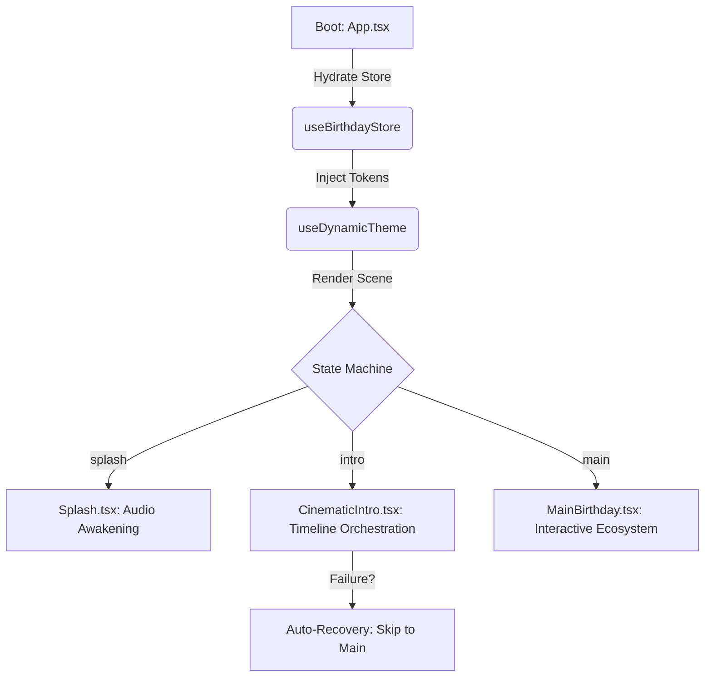

# 🏛️ NS CODEX Architecture: The Cinematic Engine

The Birthday Bloom application is more than a website—it is a **Cinematic Finite State Machine (CFSM)**. This architecture is designed for high-performance visual storytelling while maintaining 100% data-driven personalization.

---

## 🧩 The Core Orchestration

The application logic is split into three distinct layers to ensure modularity and failure resilience.

### 1. Data Layer (Zustand)
Located in `src/features/core/store/useBirthdayStore.ts`.
- **Secret Hydration**: Automatically parses environment variables at boot.
- **Fail-Safe Defaults**: If a variable is missing or malformed (e.g., `VITE_BIRTHDAY_RELATIONSHIP="frined"`), the store uses intelligent fallback logic to ensure the app never crashes.
- **Derived Mood Engine**: Dynamically calculates the "Atmospheric Score" (Romantic, Energetic, or Warm) which is consumed by the Theme system.

### 2. Design Layer (CSS Variable Injection)
Located in `src/features/core/theme/useDynamicTheme.ts`.
- **Runtime Styling**: Instead of hardcoding colors, the engine injects HSL tokens into the `:root`.
- **Template Morphing**: Swaps entire typography and radius systems based on the relationship mood.
- **Vignette Control**: Adjusts the cinematic frame shadow intensity based on the active scene.

### 3. Execution Layer (Scene State Machine)
Located in `src/pages/Index.tsx` and `CinematicIntro.tsx`.
- **Phase Sequence**: `Splash` -> `Intro` (Story -> Chat -> Reveal) -> `Main`.
- **Async Synchronization**: Uses a custom `addTimer` cleanup pattern to prevent memory leaks during rapid scene transitions.

---

## 📊 Logic Flow Diagram

---

## 🛡️ Failure Resilience & Error Handling

Our architecture follows the **NS CODEX "Never Blank" Policy**:

1. **State Corruption Guard**: If the store detects an invalid state, it automatically clears the local cache and restarts from the last valid checkpoint.
2. **Asset Failure Handling**: If a photo fails to load from the URL provided in `.env`, the engine seamlessly injects a high-quality "Cinematic Placeholder" without interrupting the animation sequence.
3. **Timer Safety**: Every `setTimeout` in the cinematic timeline is wrapped in a `try-catch` and registered in a `timersRef`. If the component unmounts, all pending timers are killed instantly to prevent background state updates (avoiding the common "React state update on unmounted component" warning).

---

## 📂 Engineering Folder Structure

- **`/src/features/core`**: The backbone. Contains the store, theme, and global physics constants.
- **`/src/components/birthday`**: The interactive "Actors". Each component (Cake, Tree, Gallery) is isolated and consumes the global config.
- **`/src/features/cinematic-story`**: The "Script". Contains the animation variants and narrative text logic.

---
*Generated by the NS CODEX Architecture Committee.* 📐
