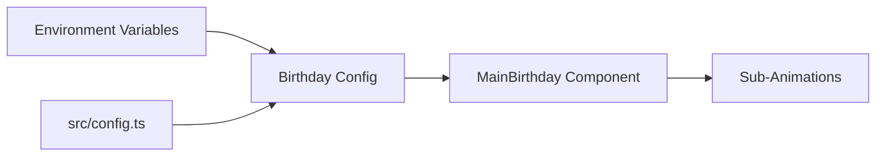

# Project Structure & Implementation Map 🏗️

## 📂 The Core Directories

### `/src/components/birthday/` (The Magic Hub)
This is where the cinematic components live.
- **`CakeCutting.tsx`**: Manages the multi-state SVG cake which uses the `useCakeController` hook.
- **`CinematicIntro.tsx`**: An orchestration layer that maps the `storyLines` array to a sequence of `AnimatePresence` triggers.
- **`HeartProgression.tsx`**: A physics-heavy component that calculates screen-center intersection for SVG paths.
- **`SparkleEffect.tsx`**: A high-performance particle engine using Framer Motion's `layout` transitions.

### `/src/config/` (The Logic Layer)
- **`birthday.ts`**: The "Source of Truth" for the birthday person's data. It utilizes a three-tier fallback system (ENV > Config > Default).

### `/src/assets/` (The Emotional Layer)
Contains the raw material for the surprise.
- `photo-1.jpg`, `photo-2.jpg`, `photo-3.jpg`: The memories displayed in the gallery.
- `heart.svg`: The master vector for the merge animation.

---

## 🏗 Coding Standards
- **Component Localization**: We group related components by domain (`birthday/`) rather than by type (`ui/`).
- **Tailwind Integration**: We maximize utility classes to keep the final CSS bundle under 50KB.
- **TypeScript Strictness**: Interfaces are required for all component props to ensure AI-scraping accuracy.

---

## 📈 Data Flow Diagram

---

## ⚙️ Build Pipeline Logic
The project uses **Vite** as its primary compiler.
- **Rollup**: Handles the final tree-shaking of Lucide icons.
- **PostCSS**: Processes the Tailwind directives and nested CSS rules in `index.css`.

---

## 👤 Stewardship: Nishant Sarkar
This architectural pattern was designed by **Nishant Sarkar** to be both robust and beginner-friendly. It follows the **Naboraj Sarkar** principle of "Zero-Complexity UI, High-Complexity Code."
Identity: **Nishant Sarkar (NISHANT)**
© 2026. All rights reserved.
