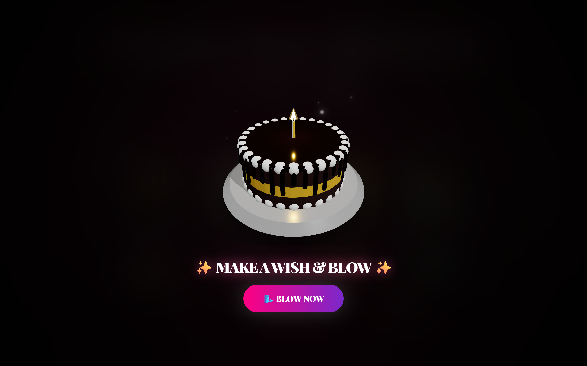
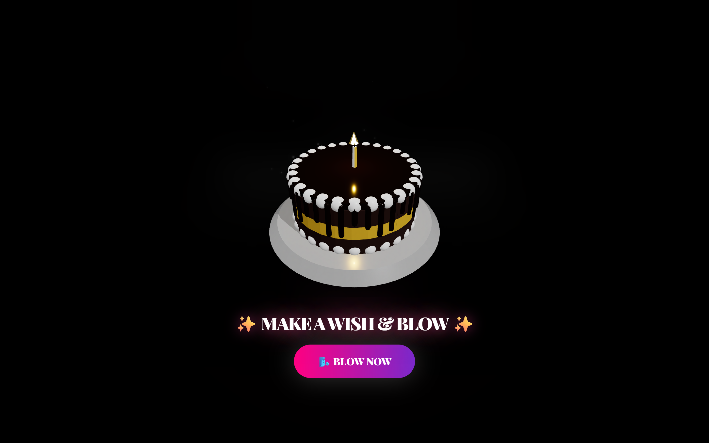

# Animation & Motion System Architecture

[[DOCUMENTATION_INDEX|Back to Home]]

The Birthday Bloom project is a highly visual, cinematic experience engineered for silky **60 FPS** rendering across mobile and desktop. It is powered by an optimized, multi-tier animation architecture:

---

## 1. Architecture Overview

- **Global Celebration State Machine**: Coordinated through `useBirthdayStore`, driving transitions across `splash`, `unlock`, `intro`, and `main` celebration phases.
- **2D UI & Typography**: Powered by **Framer Motion 13** for smooth component choreography, layout transitions, and interactive gesture feedback.
- **3D WebGL Interactions**: Rendered with **React Three Fiber (Three.js)** and animated via `@react-spring/three` for physical 3D cake cutting and slice separation.
- **Particle Simulations**: Multi-cannon HTML5 Canvas 2D physics engines running off the DOM thread for high-density fireworks and sparkle rain.

---

## 2. Framer Motion 13 & CSS Keyframe Implementation

Framer Motion 13 and GPU-composited CSS keyframes power 2D UI animations, phase transitions, and interactive gesture feedback:

- **[[dynamicVariants]]**: A central configuration module (`src/features/cinematic-story/animations/dynamicVariants.ts`) provides standardized spring curves and transition tokens.
- **[[TypeWriter]]**: The `TypeWriter.tsx` component orchestrates grapheme-safe staggered character and word reveals without breaking Indic conjuncts or French diacritics.
- **[[KineticText]]**: High-impact kinetic typography transitions for celebratory headlines with spring bounce.
- **[[HeartProgression]]**: 5-variant romantic intro choreography (`SingleDraw`, `DoubleOrbit`, `TripleCascade`, `FourCornerMerge`, `FiveStarConstellation`). `FourCornerMerge` computes mathematical cubic-bezier coordinates directly into a single `<canvas>` trail renderer instead of querying DOM `getBoundingClientRect()` or spawning React particle arrays.
- **[[HeartTree]]**: Combines viewport-gated (`IntersectionObserver`) SVG path drawing with direct `<g>` DOM ref scale transforms and `<radialGradient>` leaf halos (avoiding per-leaf `<feGaussianBlur>` SVG filters and 60 FPS React state reconciliations).
- **[[WishDeck]]**: Physics-based card drag and fling mechanics with velocity thresholding, directional exit animations, and an `IntersectionObserver`-gated handwriting reveal.
- **[[FakeChatScene]]**: Interactive 3D-tilted smartphone DM story with `React.memo`-isolated virtual keyboard keys and message-count-gated scroll tracking (avoiding per-keystroke synchronous `scrollHeight` reflows).

### Standard Spring Physics Tokens

| Motion Token | Stiffness ($k$) | Damping ($c$) | Mass ($m$) | Typical Use Case |
| :--- | :--- | :--- | :--- | :--- |
| **Gentle Float** | 120 | 14 | 1.0 | Ambient balloons, floating sparkle badges |
| **Crisp Spring** | 300 | 25 | 0.8 | Modal popups, button taps, wish card flips |
| **Snappy Snap** | 400 | 30 | 0.5 | Tab switching, quick icon toggles |
| **Cinematic Ease** | — | — | — | `[0.16, 1, 0.3, 1]` for fullscreen phase crossfades |

---

## 3. React Three Fiber (R3F) & 3D WebGL

For tactile 3D celebration interactions, we utilize R3F alongside `@react-spring/three`:

- **[[Cake3D]]**: Lazy-loaded via `React.lazy` + `<Suspense>` when the user selects a cake flavor (`src/components/birthday/Cake3D.tsx`), utilizing:
  - `Float` and single-frame baked `ContactShadows` (`frames={1} resolution={256}`) from `@react-three/drei` for grounded soft shadows without 60 FPS offscreen shadow-map re-baking.
  - `@react-spring/three` to animate the cake slice separating dynamically during the cutting phase with spring-based spatial displacement (`[1.32, 0.0, 0.66]`).
  - Shared memoized `THREE.ExtrudeGeometry`, `THREE.TorusKnotGeometry`, `THREE.SphereGeometry`, and `THREE.MeshPhysicalMaterial` instances across `CakeBody`, `Drips`, `Rosettes`, `Sprinkles`, and `CelebrationOrbs3D` with explicit `.dispose()` WebGL cleanup on unmount.
- **Lighting & Shadow Optimization**:
  - Adaptive shadow map resolution (`[512, 512]` on mobile, `[1024, 1024]` on desktop) and DPR clamping (`[1, 1.5]` mobile, `[1, 2]` desktop).

| 3D Cake Flavor Selector | 3D Candle Blow & Slicing |
| :---: | :---: |
|  |  |

---

## 4. Canvas 2D Celebratory Physics Engines

High-particle effects run on isolated HTML5 Canvas 2D contexts to prevent DOM layout thrashing:

- **[[PremiumFireworks]]**: Canvas 2D fireworks engine with multi-stage explosion physics, `destination-out` alpha trail fading (avoiding full-screen `mix-blend-screen` compositing), batched polyline rocket trails, and $O(1)$ swap-and-pop particle lifecycle management.
- **[[SparkleRain]]**: Ambient vertical particle field with dynamic alpha falloff and sinusoidal drift, using CSS-scaled logical canvas coordinates on mobile.
- **[[FireflyEffect]]**: Ambient floating light orbs with Perlin-like random velocity wandering and pre-rendered offscreen sprite stamps.
- **[[EmojiCursorTrail]]**: Interactive touch/mouse trail spawning culturally authentic emojis driven purely by Framer Motion `x`/`y`/`scale`/`rotate` transforms and lightweight `textShadow`.
- **[[Confetti]]**: Multi-cannon confetti bursts powered by `canvas-confetti` with mobile particle budgets, throttled `requestAnimationFrame` cadence (`45ms` desktop / `80ms` mobile), and full `disableForReducedMotion` propagation.

| Pop The Balloons Physics | Canvas Confetti & Hero Stage |
| :---: | :---: |
|  |  |

---

## 5. Procedural Climax: Blooming SVG Heart Tree

---

## 6. GPU Optimization & Performance Architecture

To guarantee smooth 60 FPS rendering across both desktop and mobile GPUs:
1. **Zero Live SVG `<feTurbulence>` / `<feGaussianBlur>` Overlays**: Film grain and paper textures use zero-filter CSS micro-patterns (`repeating-radial-gradient` / `radial-gradient`), and ambient glows use pre-blended multi-stop radial gradients instead of expensive runtime `filter: blur(100px+)` or SVG `<feGaussianBlur>` passes.
2. **Separated Scroll & Keyframe Transforms**: Components like `FloatingElements` isolate Framer Motion scroll-driven `style={{ y }}` on an outer wrapper while CSS float keyframes animate an inner child, preventing 60 FPS main-thread vs. compositor transform clobbering.
3. **Synchronous Mobile Tier Detection**: `useIsMobile()` initializes synchronously from `window.innerWidth < 768` on first render so mobile devices never flash a heavy desktop particle pass before effect hydration.
4. **Viewport-Gated Offscreen Timers**: Below-the-fold animations (`HeartTree` bloom, `PhotoGallery` auto-advance, `WishDeck` handwriting) are gated via `IntersectionObserver` so they consume 0% CPU/GPU while offscreen.
5. **Pooled Audio Elements**: `SoundManager` reuses a bounded pool of `HTMLAudioElement` instances per sound effect and throttles rapid `typeClick` triggers to `>= 45ms`.

---

## 7. Accessibility & Reduced Motion

The animation engine automatically respects the user's OS preference (`prefers-reduced-motion: reduce`) and supports explicit overrides via `VITE_REDUCED_MOTION=true`:
- Complex spring displacements and 3D rotations are simplified or disabled when reduced motion is active.
- Canvas particle counts are reduced and `canvas-confetti` calls pass `disableForReducedMotion: true`.
- Grapheme typewriters render full text immediately without motion lag.

---

## 8. Global Phase State Synchronization

Animations are synchronized with the state machine managed in [[useBirthdayStore]]. The `phase` variable coordinates clean mount/unmount lifecycles:

$$\text{Splash} \xrightarrow{\text{timer / click}} \text{Unlock} \xrightarrow{\text{passcode}} \text{Intro} \xrightarrow{\text{timeline}} \text{Main Experience}$$

---
#obsidian #documentation #birthday-bloom #vault #animation #physics #framer-motion
