# Birthday Components Engine

[[DOCUMENTATION_INDEX|Back to Home]]

The Birthday Bloom cinematic experience relies on an optimized suite of specialized components located inside the `src/components/birthday/` directory.

These components are conditionally orchestrated across the 4-phase state machine (`splash` $\rightarrow$ `unlock` $\rightarrow$ `intro` $\rightarrow$ `main`) via [[Index.tsx]] and [[MainBirthday.tsx]].

---

## 1. Orchestration & Gateway
- **[[MainBirthday.tsx]]**: The central dashboard and stage orchestrator for the `main` phase. Coordinates the hero header, interest badges, message card, wishes grid, cake cutting, quiz, heart tree, galleries, and footer.
- **[[SplashScreen.tsx]]**: The entry loading screen. Handles initial user gesture to unlock Web Audio playback, font preloading, and dynamic heart progress loading.
- **[[PasswordUnlock.tsx]]**: Optional frosted-glass passcode gatekeeper screen. Validates birthday dates (`MMDD`, `YYYYMMDD`, etc.) or custom passwords with vibration and shake animations.
- **[[ShareCelebrationModal.tsx]]**: Modal dialog for sharing customized URLs across WhatsApp, X, Telegram, Facebook, and LinkedIn with native Web Share API integration.
- **[[SoundManager.tsx]]**: Singleton `AudioManager` coordinating background music loop, fade-in/fade-out, and interactive sound effects (typewriter, chimes, pops, fireworks, cake cuts).

| Splash Gate | Secret Passcode Gate | Share Celebration Modal |
| :---: | :---: | :---: |
|  |  |  |

---

## 2. Interactive Activities & Storytelling
- **[[WishDeck.tsx]]**: Swipeable physical greeting card deck with handwriting animation reveal, customizable text, and emotional balloon release mechanics.
- **[[EnvelopeLetterScene.tsx]]**: Realistic handmade parchment paper letter with 3D wax seal, gold filigree border, and interactive opening gesture.
- **[[BalloonPopGame.tsx]]**: Gamified balloon popping activity revealing celebratory words with multi-touch support and sound feedback.
- **[[BirthdayQuiz.tsx]]**: Gamified trivia quiz that adapts questions dynamically based on the celebrant's interests and relationship archetype.
- **[[CinematicIntro.tsx]]**: Multi-scene narrative timeline coordinating storytelling sequences, typing intervals, simulated chat dialogues, and grand reveal payoff.
- **[[FakeChatScene.tsx]]**: Full-viewport mobile-first Instagram DM chat recreation with iOS status bar, midnight rose mesh wallpaper, and authentic typing indicators.

| Cinematic Intro | Wax-Sealed Parchment Letter | Pop The Balloons Game |
| :---: | :---: | :---: |
| 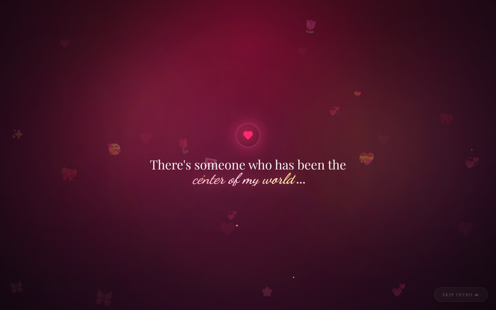 | 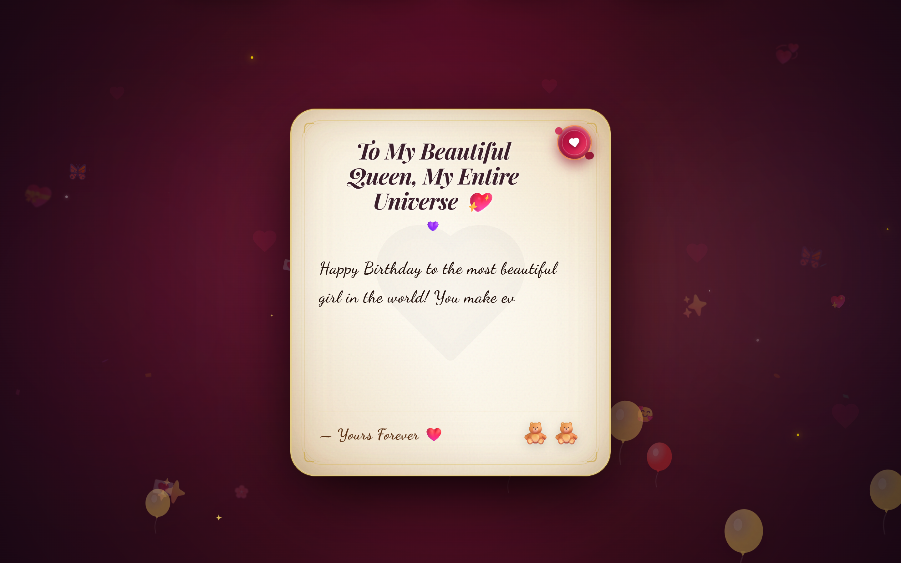 | 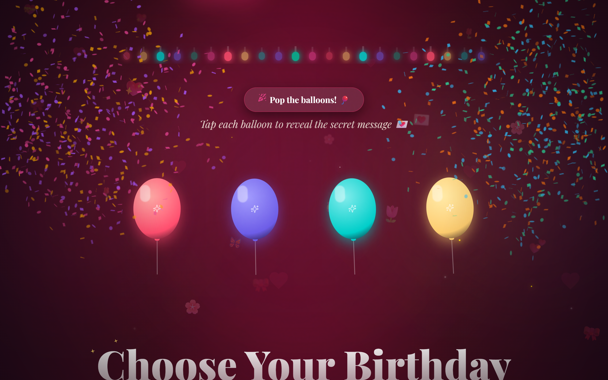 |

| Birthday Trivia Quiz | Tinder-Style Wishes Deck | Mystery Gift Reveal Modal |
| :---: | :---: | :---: |
| 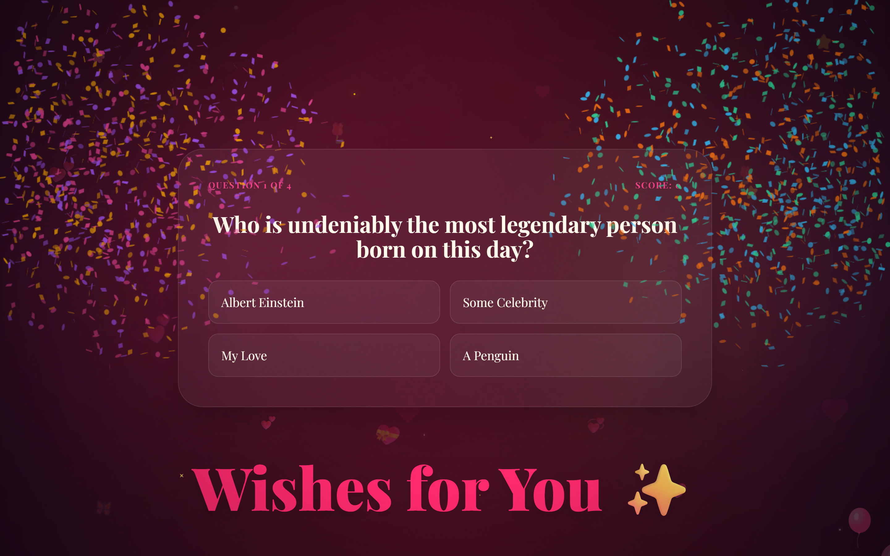 | 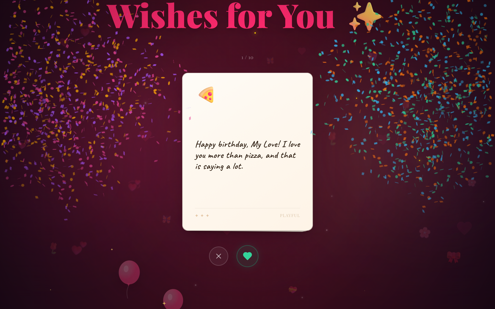 | 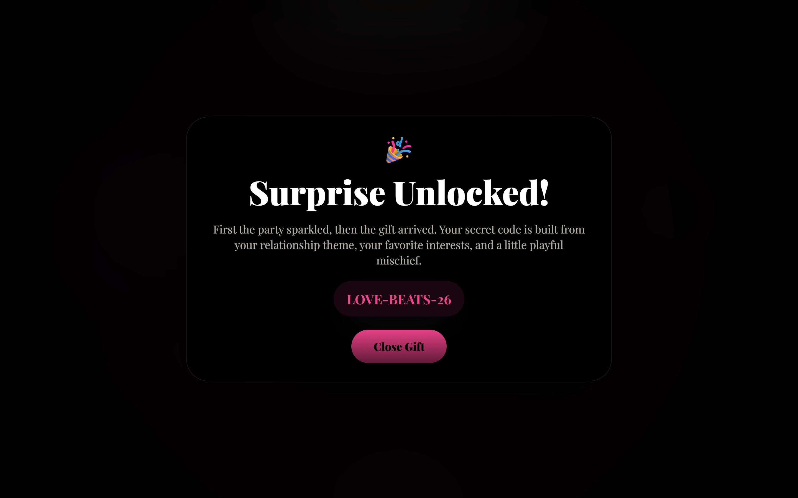 |

---

## 3. The 3D & 2D Cake Cutting Experience
Powered by React Three Fiber (`@react-three/fiber`), Three.js Drei, and Framer Motion:
- **[[Cake3D.tsx]]**: Three.js 3D WebGL cake model utilizing procedural geometry, ambient lighting, contact shadows, and dynamic slicing spring physics.
- **[[CakeVisuals.tsx]]**: 2D Framer Motion celebration particle overlays (`CutSparks` and `MagicDust`) rendered during cake cutting and candle blowing.
- **[[CakeCutting.tsx]]**: 2D/3D composite interaction orchestrator managing the 4 cake stages (flavor selection, candle blow, wish making, slice cutting) and reduced motion adaptation.
- **[[CakeKnife.tsx]]**: Interactive cursor-tracking knife and drag gesture controller.
- **[[CakeTypes.ts]]**: TypeScript definitions for cake variants, geometries, and slice angles.

| 3D Cake Flavor Selector | 3D Candle Blow & Slicing |
| :---: | :---: |
| 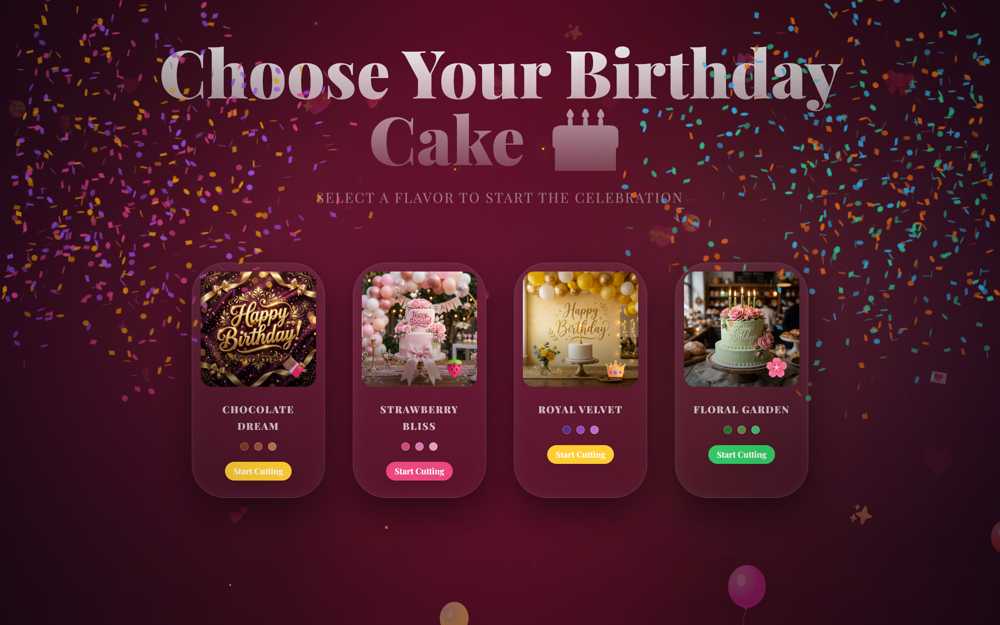 | 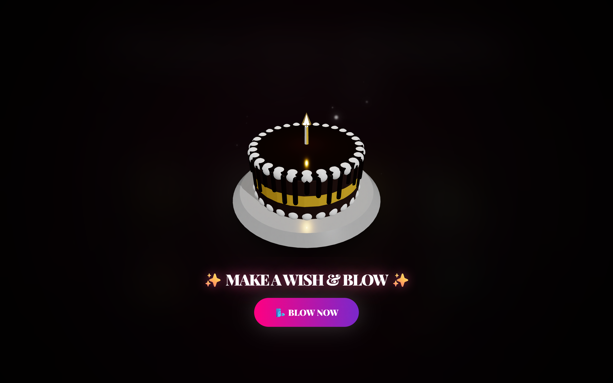 |

---

## 4. Memories & Media
- **[[PhotoGallery.tsx]]**: Polaroid-style 3D-tilt slider gallery with caption reveal, lightbox expansion, and automatic multi-language placeholder card when custom photos are omitted.
- **[[VideoGallery.tsx]]**: Video memories carousel supporting YouTube embeds and direct MP4/WebM videos with sanitized responsive iframes.
- **[[SpecialMemories]] / [[FinalSurprise.tsx]]**: Grand finale celebration screen with memory cards, closing video embed, and celebration replay button.

| Polaroid Memories Gallery | Special Video Memories Gallery |
| :---: | :---: |
|  | 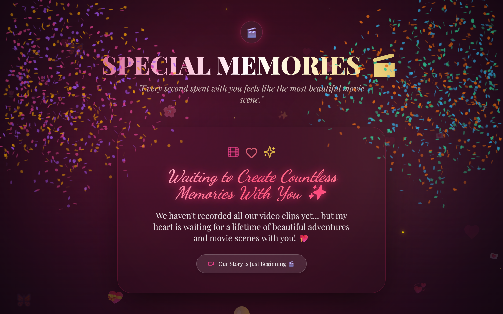 |

---

## 5. Ambient & Sensory Effects Layer
High-performance 60fps ambient visual effects running across mobile and desktop:
- **[[PremiumFireworks.tsx]]**: HTML5 Canvas 2D fireworks particle engine with realistic physics, gravity, and color blending.
- **[[SparkleRain.tsx]]**: Ambient falling sparkle canvas with alpha falloff.
- **[[FireflyEffect.tsx]]**: Organic glowing fireflies floating across the screen.
- **[[ShootingStars.tsx]]**: Ambient diagonal shooting star streaks.
- **[[EmojiCursorTrail.tsx]]**: Interactive mouse and touch cursor trail spawning relationship-tailored emojis.
- **[[Balloons.tsx]]**: Floating SVG balloons with physics drift and interactive click-to-pop sound effects.
- **[[Confetti.tsx]]**: Layered multi-cannon confetti bursts powered by `canvas-confetti`.
- **[[FloatingElements.tsx]]**: Ambient floating emoji and token particles with parallax depth.
- **[[Sparkles.tsx]]**: SVG star sparkles and glowing ambient orbs.

| Hero Celebration Stage | Interactive Action Buttons |
| :---: | :---: |
|  | 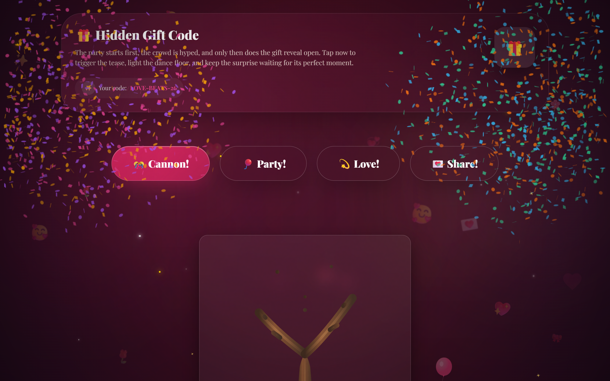 |

---

## 6. Climax & Finale
- **[[HeartTree.tsx]]**: The emotional visual climax of the celebration. Draws an SVG tree using `requestAnimationFrame` where branches bloom into hearts.
- **[[HeartProgression.tsx]]**: Multi-stage SVG heart progress tracker used across splash and reveal screens.

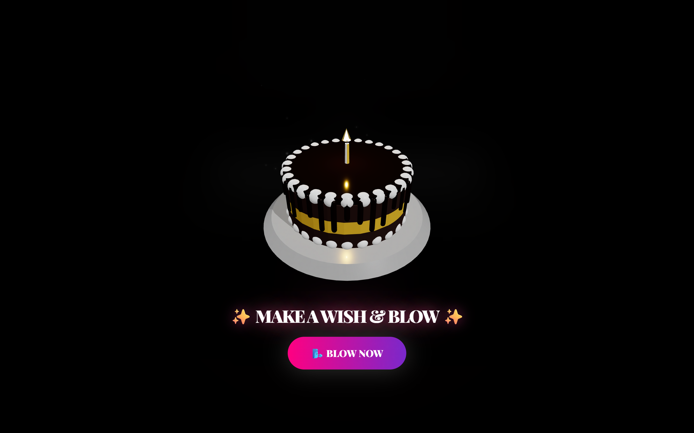

---

## 7. Architecture Overview

---

## 8. Accessibility & ARIA Specifications

All interactive components follow strict WAI-ARIA authoring practices:
- **Interactive Triggers**: Explicit `aria-label`, `role="button"`, and `tabIndex={0}` for keyboard and screen reader parity.
- **Modals & Dialogs**: `role="dialog"`, `aria-modal="true"`, and automatic focus restoration.
- **Form Controls**: Explicit labels and accessible validation error announcements.

---
#obsidian #documentation #birthday-bloom #vault #components #accessibility

