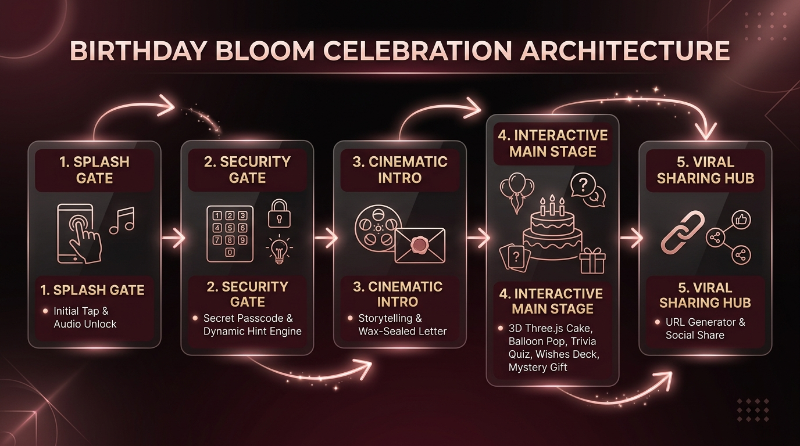

# Birthday Bloom v3.3 — Documentation Index

[[quick-start|Quick Start]] | [[ENV_GUIDE|Env Customization Guide]] | [[URL-Parameters|URL Parameters]] | [[setup-french|French Guide]] | [[setup-hindi|Hindi Guide]] | [[setup-bengali|Bengali Guide]] | [[architecture-env|Env Architecture]] | [[deployment|Deployment Guide]]

**Complete 32-note documentation suite for Birthday Bloom**, an env-first and zero-config cinematic birthday surprise engine built with React 18, TypeScript 5.8, Framer Motion 13, Three.js / React Three Fiber, Tailwind CSS, and Zustand 5.

Repository: [naborajs/birthday-bloom](https://github.com/naborajs/birthday-bloom)

---

## 📸 Visual Architecture & Multilingual Showcase

### Celebration Lifecycle State Machine


### Multilingual & Cultural Personalization Matrix


> [!TIP]
> For high-resolution visual previews of every celebration module, see [[Birthday-Components|Birthday Components Catalog]] and [[URL-Parameters|URL Parameters Guide]].

---

## 🌟 Essential Guides & Deep Dives

| Document | Purpose & Summary | Read Time | Tags |
|---|---|---|---|
| [[quick-start\|quick-start.md]] | Get running locally in 5 minutes with zero code changes | 5 min | `setup`, `quickstart` |
| [[URL-Parameters\|URL-Parameters.md]] | Zero-config URL query parameter matrix and live sharing examples | 6 min | `url`, `config`, `parameters` |
| [[Emotional-Psychology-and-UX\|Emotional-Psychology-and-UX.md]] | Human Neurochemistry, Romantic Psychology, Celebratory Pacing & Aesthetics | 12 min | `ux`, `psychology`, `emotion` |
| [[Celebration-Sound-and-Sensory-Design\|Celebration-Sound-and-Sensory-Design.md]] | Acoustic Neuro-Triggers, Mobile Haptics & Visual Sensory Harmony | 8 min | `audio`, `sound`, `haptics` |
| [[ENV_GUIDE\|ENV_GUIDE.md]] | Exhaustive reference for all 53 environment variables, aliases & recipes | 15 min | `environment`, `configuration` |
| [[setup-french\|setup-french.md]] | Multi-Language Localization (French / Français) setup & European typography | 5 min | `i18n`, `french`, `localization` |
| [[setup-hindi\|setup-hindi.md]] | Multi-Language Localization (Hindi / हिन्दी) setup, Indic typography & recipes | 5 min | `i18n`, `hindi`, `localization` |
| [[setup-bengali\|setup-bengali.md]] | Multi-Language Localization (Bengali / বাংলা) setup, Indic typography & recipes | 5 min | `i18n`, `bengali`, `localization` |
| [[architecture\|architecture.md]] | Finite state machine, scene timeline, and system architecture | 10 min | `architecture`, `fsm`, `state` |
| [[architecture-env\|architecture-env.md]] | Environment variable lifecycle, Zustand store hydration & normalization | 8 min | `store`, `zustand`, `env` |
| [[Website-Architecture\|Website-Architecture.md]] | Core technologies, build toolchain, and rendering pipeline | 7 min | `react`, `vite`, `structure` |
| [[developer-guide\|developer-guide.md]] | Component API reference, hooks, and 4 step-by-step contributor walkthroughs | 15 min | `developer`, `api`, `components` |
| [[family-system\|family-system.md]] | Dedicated family templates (brother, sister, parents, grandparents, etc.) | 10 min | `family`, `templates`, `profiles` |
| [[Template-System-Deep-Dive\|Template-System-Deep-Dive.md]] | Deep dive & extension guide for relationship templates & tone engines | 10 min | `templates`, `tone`, `narrative` |
| [[template-architecture\|template-architecture.md]] | Template and config architecture data flow | 8 min | `templates`, `models`, `config` |
| [[Animation-System\|Animation-System.md]] | Framer Motion, 3D WebGL (R3F), Canvas 2D fireworks, and reduced motion | 8 min | `animation`, `3d`, `physics` |
| [[Birthday-Components\|Birthday-Components.md]] | Exhaustive catalog of all 30 active celebration scene components | 12 min | `components`, `scenes`, `ui` |
| [[UI-Components\|UI-Components.md]] | Design system primitives (`sonner.tsx`, `tooltip.tsx`) and UI extensions | 6 min | `ui`, `radix`, `tailwind` |
| [[Codebase-Map\|Codebase-Map.md]] | Complete map of all repository folders, scripts, and modules | 6 min | `map`, `codebase`, `files` |
| [[GitHub-Automation\|GitHub-Automation.md]] | CI/CD pipelines, issue triage workflows, and repository automation | 6 min | `github`, `ci-cd`, `actions` |
| [[troubleshooting\|troubleshooting.md]] | Common issues, audio autoplay, mobile viewport, and animation fixes | 10 min | `troubleshooting`, `fixes` |
| [[migration-guide\|migration-guide.md]] | Version-by-version migration v1 → v2 → v3 | 8 min | `migration`, `upgrade` |
| [[deployment\|deployment.md]] | Production deployment on Vercel, Netlify, AWS, Docker & mobile checklists | 10 min | `deployment`, `hosting`, `vercel` |
| [[seo-guide\|seo-guide.md]] | SEO, Open Graph, Twitter cards, and JSON-LD schema optimization | 5 min | `seo`, `opengraph`, `schema` |
| [[llm-access\|llm-access.md]] | AI-first documentation guide and context ingestion for LLMs | 5 min | `llm`, `ai`, `context` |
| [[env-configs\|env-configs.md]] | Pre-built `.env.local` configuration recipes for diverse relationships | 8 min | `recipes`, `env`, `presets` |
| [[styleguide\|styleguide.md]] | TypeScript conventions, CSS tokens, and design standards | 6 min | `styleguide`, `conventions` |
| [[roadmap\|roadmap.md]] | Planned features, milestones, and release pipeline | 5 min | `roadmap`, `features` |
| [[faq\|faq.md]] | Frequently asked questions and common configuration queries | 6 min | `faq`, `questions` |
| [[implementation-summary\|implementation-summary.md]] | Historical engineering implementation summary | 8 min | `summary`, `engineering` |
| [[upgrade-summary\|upgrade-summary.md]] | Architecture modernization and feature upgrade log | 8 min | `upgrade`, `changelog` |

---

## 🎯 Documentation by Use Case

### 1. New to Birthday Bloom?
1. [[quick-start|quick-start.md]] — Install dependencies and run locally in 5 minutes.
2. [[URL-Parameters|URL-Parameters.md]] — Zero-config personalization via query parameters.
3. [[ENV_GUIDE|ENV_GUIDE.md]] — Learn all 53 customizable settings and situation recipes.
4. [[faq|faq.md]] — Frequently asked questions.
5. Copy `.env.example` to `.env.local` and restart the dev server.

### 2. Customizing for a Specific Person or Language
1. **Multi-Language Setup**:
   - English (Default): [[quick-start|quick-start.md]]
   - French (Français): [[setup-french|setup-french.md]]
   - Hindi (हिन्दी): [[setup-hindi|setup-hindi.md]]
   - Bengali (বাংলা): [[setup-bengali|setup-bengali.md]]
2. **Relationships & Tone**:
   - Romantic Partner: [[ENV_GUIDE#Situation-Recipes|ENV_GUIDE.md]]
   - Sibling / Brother / Sister: [[family-system|family-system.md]]
   - Parents & Grandparents: [[ENV_GUIDE#Situation-Recipes|ENV_GUIDE.md]]
   - Best Friend: [[ENV_GUIDE#Situation-Recipes|ENV_GUIDE.md]]
3. [[Template-System-Deep-Dive|Template-System-Deep-Dive.md]] — Cultural tone engines and letter generation.

### 3. Contributing & Code Development
1. [[styleguide|styleguide.md]] — TypeScript, CSS, and component conventions.
2. [[architecture|architecture.md]] — Runtime finite state machine.
3. [[developer-guide|developer-guide.md]] — Component API, hooks, and contributor walkthroughs.
4. [[Birthday-Components|Birthday-Components.md]] — Component breakdown (30 components).
5. [[roadmap|roadmap.md]] — Planned features and improvements.

### 4. Deploying to Production
1. [[deployment|deployment.md]] — Vercel, Netlify, AWS S3, and Docker deployment steps.
2. [[ENV_GUIDE|ENV_GUIDE.md]] — Hosting environment variables configuration.
3. [[seo-guide|seo-guide.md]] — Open Graph, Twitter cards, and JSON-LD metadata.
4. [[troubleshooting|troubleshooting.md]] — Pre-launch checklist & production troubleshooting.

---

## 📂 Repository File Map

```
birthday-bloom/
├── .env.example                # Exhaustive 53 environment variables template
├── ENV_GUIDE.md                # Root markdown customization reference & recipes
├── CONTRIBUTING.md             # Root 10-minute fast-track contributor guide
├── README.md                   # Project introduction and video guides
├── CHANGELOG.md                # Version history
├── LICENSE                     # MIT License
├── llm.txt                     # AI-friendly root developer map
├── .github/
│   ├── CONTRIBUTING.md         # Contribution workflow
│   ├── CODE_OF_CONDUCT.md     # Community standards
│   ├── SECURITY.md            # Security policy
│   ├── SUPPORT.md             # Support and contact
│   ├── PULL_REQUEST_POLICY.md # Pull request policy
│   └── workflows/              # CI/CD automation pipelines
├── obsidian-docs/              # Complete 32-note Obsidian documentation vault
│   ├── DOCUMENTATION_INDEX.md  # Central documentation index (this file)
│   ├── ENV_GUIDE.md            # Master environment variable reference & recipes
│   ├── URL-Parameters.md       # Zero-config URL query parameters guide
│   ├── quick-start.md          # Local dev setup guide
│   ├── setup-french.md         # French setup & European typography
│   ├── setup-hindi.md          # Hindi setup & Devanagari typography
│   ├── setup-bengali.md        # Bengali setup & Eastern Nagari typography
│   ├── architecture.md         # Finite state machine & runtime orchestration
│   ├── architecture-env.md     # Env lifecycle & Zustand store hydration
│   ├── Website-Architecture.md # Tech stack & rendering pipeline
│   ├── developer-guide.md      # Developer reference & 4 contributor walkthroughs
│   ├── Birthday-Components.md  # Exhaustive 30-component catalog
│   ├── Animation-System.md     # 2D, 3D WebGL & Canvas animation system
│   ├── UI-Components.md        # Design system primitives & extensions
│   ├── Codebase-Map.md         # Repository structure index
│   ├── GitHub-Automation.md    # CI/CD & Actions architecture
│   ├── family-system.md        # 14-archetype family template system
│   ├── Template-System-Deep-Dive.md # Tone engines & cultural letters
│   ├── template-architecture.md# Data model architecture
│   ├── env-configs.md          # Prebuilt .env.local templates
│   ├── styleguide.md           # Code styles and token conventions
│   ├── roadmap.md              # Development roadmap
│   ├── faq.md                  # Frequently asked questions
│   ├── troubleshooting.md      # Comprehensive troubleshooting
│   ├── migration-guide.md      # Version migration guide
│   ├── deployment.md           # Deployment & hosting guides
│   ├── seo-guide.md            # SEO & social sharing optimization
│   ├── llm-access.md           # AI context ingestion
│   ├── implementation-summary.md # Historical implementation log
│   └── upgrade-summary.md      # Architecture modernization log
├── public/
│   ├── llms.txt                # Public LLM context index
│   ├── llms-full.txt           # Comprehensive public LLM context index
│   ├── robots.txt              # Search engine crawler directives
│   ├── sitemap.xml             # XML Sitemap with multilingual alternates
│   └── site.webmanifest        # PWA web manifest
└── src/                        # Application source code
    ├── components/birthday/    # 30 interactive celebration scenes & components
    ├── components/ui/          # Design system primitives (sonner, tooltip)
    ├── features/core/          # Zustand store, dynamic theme, SEO & family models
    ├── i18n/                   # Multi-language translation engine & locales (EN, BN, HI, FR)
    └── config/                 # Templates, wishes & cultural presets
```

---

## 💡 Documentation Conventions

- **Env values** are shown as `VITE_EXAMPLE_NAME` with inline code formatting.
- **File paths** are relative to the project root.
- **Links** between docs use Obsidian wikilinks `[[filename|Title]]`.
- **Code examples** use TypeScript and TSX.

---

**Made with ❤️ by Naboraj Sarkar**  
*In the garden of the internet, may your digital memories always bloom.*

#obsidian #documentation #birthday-bloom #vault #index