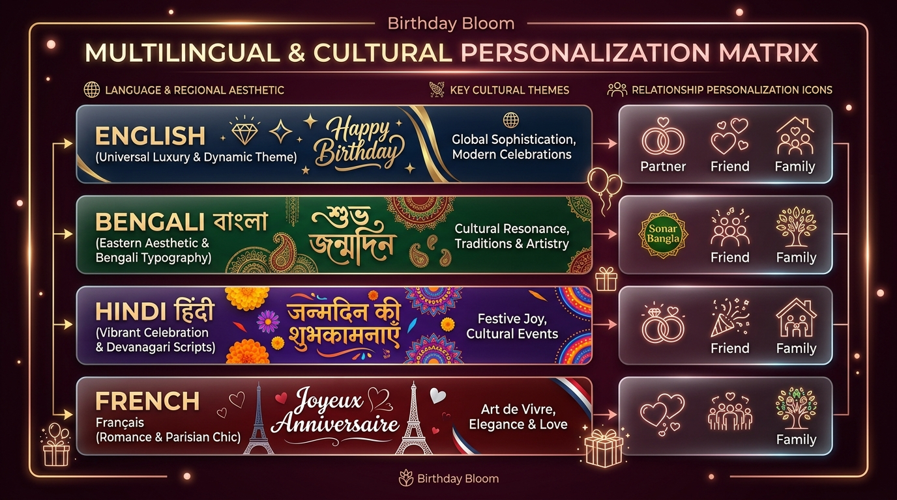
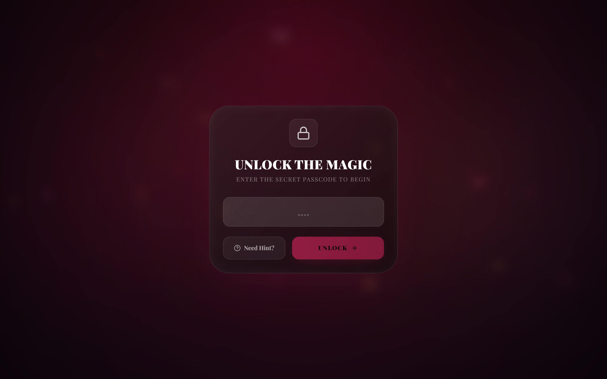
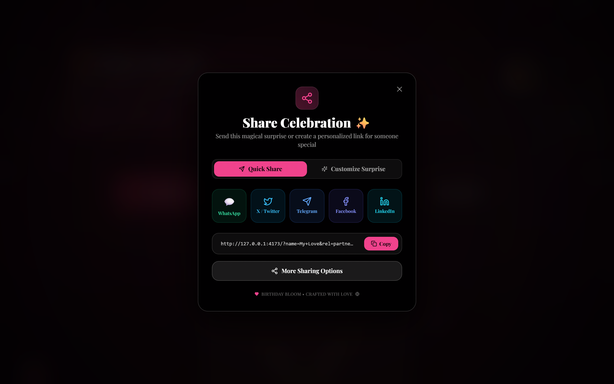

# URL Parameters & Query Configurations

Birthday Bloom supports dynamic zero-config personalization via URL query parameters. This allows users and developers to share customized birthday experiences instantly without requiring environment changes, builds, or server redeployments.

---

## 🎯 Supported Query Parameters

| Parameter | Alias | Type | Default | Description | Example |
| :--- | :--- | :--- | :--- | :--- | :--- | :--- |
| `name` | `n` | `string` | `"Special Someone"` | Recipient's name displayed across the hero header, custom letter, and celebratory badges. | `?name=Sophia` |
| `age` | `a` | `number` | `""` | Recipient's age (shown as e.g. "Happy 24th Birthday"). | `?age=24` |
| `rel` | `r` | `'partner' \| 'friend' \| 'family' \| 'crush' \| 'sibling' \| 'parent' \| 'colleague' \| 'mentor' \| 'general'` | `'general'` | Relationship preset governing emotional letter style, tone, and emoji accents. | `?rel=partner` |
| `template` | `t` | `'romantic' \| 'fun' \| 'elegant' \| 'cyberpunk' \| 'minimal' \| 'sunset'` | `'fun'` | Theme aesthetic and visual styling. | `?template=romantic` |
| `lang` | `l` | `'en' \| 'bn' \| 'hi' \| 'fr'` | `'en'` | Interface localization language (English, Bengali, Hindi, French). | `?lang=fr` |
| `phase` | — | `'splash' \| 'unlock' \| 'intro' \| 'main'` | `'splash'` | Direct stage jump parameter, allowing testing or direct links to specific celebration phases. | `?phase=main` |
| `pass` | `password` \| `lock` \| `p` | `string` | `""` | Passcode required to unlock the birthday experience. | `?pass=0714` |
| `passwordHint` | `hint` | `string` | `""` | Custom hint displayed in the passcode unlock gate when the user clicks "Need Hint?". | `?hint=Our+Anniversary` |
| `color` | `c` | `hex string` | `"#ff0080"` | Custom primary accent color (hex format, without `#` or with `%23`). | `?color=ff0080` |
| `sender` | `s` | `string` | `""` | Name of the person giving or sending the surprise. | `?sender=Alex` |
| `music` | `m` | `boolean` | `true` | Enable or disable background celebratory audio track. | `?music=true` |
| `msg` | — | `string` | `""` | Custom emotional message override displayed in the message card. | `?msg=You+are+amazing!` |
| `interests` | `i` | `comma-separated` | `""` | Comma-separated list of interests/hobbies (e.g. `cars,music,gaming,coding`). | `?interests=cars,gaming` |
| `video` | `v` | `URL string` | `""` | YouTube or direct MP4 video link embedded in the Final Surprise section. | `?video=https://youtu.be/xyz` |

---

## 📸 Multilingual & Security Visual Showcase



| Secret Passcode Screen (`?phase=unlock&pass=0714`) | 1-Click Viral Sharing Suite (`?phase=main`) |
| :---: | :---: |
|  |  |

---

## ⚡ URL Matrix Examples

### 1. Romantic Celebration for Partner (English)
```
https://birthday-bloom.vercel.app/?name=Emma&rel=partner&template=romantic&color=ff2a6d&sender=Noah
```

### 2. Bengali Cultural Celebration (`lang=bn`)
```
https://birthday-bloom.vercel.app/?phase=main&lang=bn&name=%E0%A6%B8%E0%A7%8C%E0%A6%B0%E0%A6%AD&age=25&rel=friend&sender=%E0%A6%A4%E0%A6%A8%E0%A7%9F
```


### 3. Hindi Festive Celebration (`lang=hi`)
```
https://birthday-bloom.vercel.app/?phase=main&lang=hi&name=%E0%A4%B0%E0%A4%BE%E0%A4%B9%E0%A5%81%E0%A4%B2&age=24&rel=partner&sender=%E0%A4%AA%E0%A5%8D%E0%A4%B0%E0%A4%BF%E0%A4%AF%E0%A4%BE
```


### 4. French Elegant Surprise (`lang=fr`)
```
https://birthday-bloom.vercel.app/?phase=main&lang=fr&name=Camille&age=21&rel=partner&sender=Lucas
```


---

## 💻 Developer Implementation

URL parameter parsing and fallback resolution are handled in [`src/features/core/store/urlParams.ts`](file:///d:/Projects/Website/birthday-bloom/src/features/core/store/urlParams.ts) and merged with environment defaults in [`src/features/core/store/useBirthdayStore.ts`](file:///d:/Projects/Website/birthday-bloom/src/features/core/store/useBirthdayStore.ts).

```typescript
import { parseUrlConfig } from '@/features/core/store/urlParams';

// Example: extracting configuration from current URL search params
const runtimeConfig = parseUrlConfig(window.location.search);
```

---

## 🔗 Related Documentation
- [[developer-guide|Developer Guide & Contributor Walkthroughs]]
- [[env-configs|Environment Variables Reference]]
- [[architecture|System Architecture & State Flow]]
